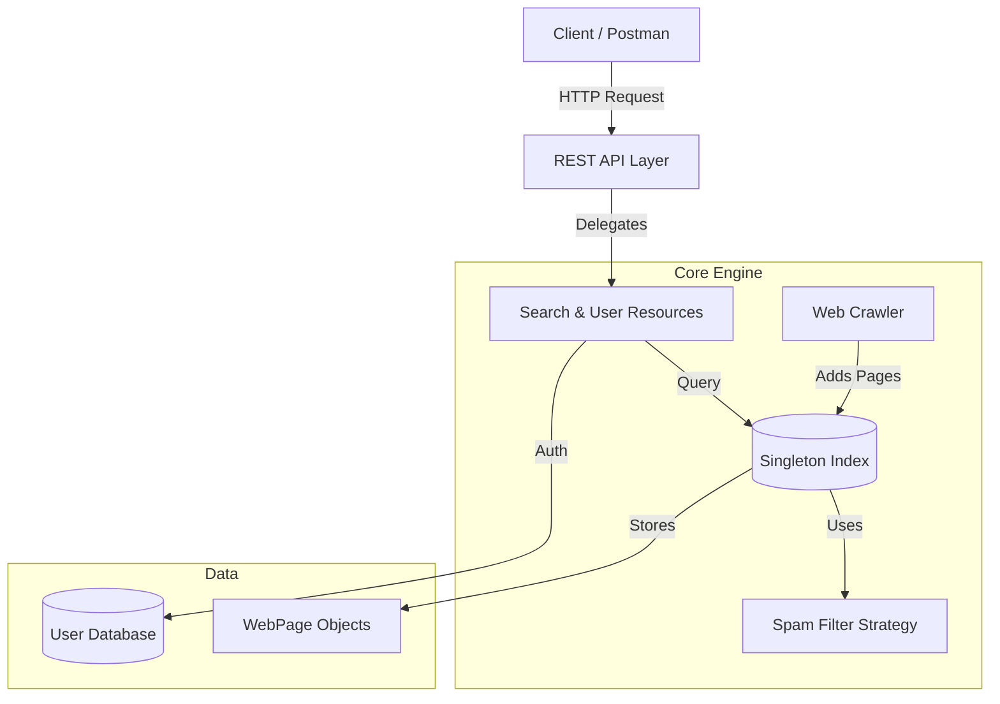

## Java RESTful Search Engine Simulation


-blue)


A modular search engine backend simulation built with **Java** and **JAX-RS (Jersey)**. This project demonstrates software engineering principles like **Design Patterns** (Singleton, Factory, Strategy), **REST API** development, and **Object-Oriented Architecture**.

## Architecture
The system is designed with a separation of concerns, using a Singleton `Index` for data consistency and Factory patterns for content processing.



## Key Features

* **RESTful API:** Functional endpoints for Searching, User Management, and Admin controls.
* **Smart Parsing:** Uses **Regex (Regular Expressions)** to extract metadata and hyperlinks from raw content.
* **System Diagnostics:** Monitors real-time Java Runtime memory usage and database integrity.
* **Web Crawler Simulation:** Multi-threaded logic to fetch and parse web content dynamically.
* **Spam Filtering:** Implements the **Strategy Pattern** to switch between "Strict" and "Relaxed" spam filtering rules at runtime.

## Tech Stack

* **Language:** Java (JDK 17)
* **Framework:** Jersey (JAX-RS) for REST services
* **Server:** Grizzly HTTP Server
* **Core Concepts:** OOP, Collection Iterators, Memory Management

## API Endpoints

| Method | Endpoint | Description |
| :--- | :--- | :--- |
| `GET` | `/search?q={query}` | Execute a search query. |
| `POST` | `/search` | Trigger the crawler with seed URLs. |
| `GET` | `/users/{id}` | Retrieve user profile and bookmarks. |
| `POST` | `/users/{id}/bookmarks` | Save a bookmark for a user. |
| `PUT` | `/admin/spam-strategy` | Change spam filter mode (Strict/Relaxed). |

## How to Run

1. **Clone the repository**
   ```bash
   git clone [https://github.com/jelicandela/Java-Search-Engine.git](https://github.com/jelicandela/Java-Search-Engine.git)
   ```
2. **Compile and Run the Simulation**
   Run `MainSearchEngine.java` in your IDE to see the console simulation of the system architecture, Crawler, and Admin dashboard.
3. **Run the API Server**
   Run `RestServer.java` to boot up the backend. Test the endpoints at:
   `http://localhost:8080/search-engine/`

## Design Patterns Used

* **Singleton:** Used for the `Index` and `UserDatabase` to ensure a single, global source of data.
* **Factory Method:** Used in `WebPageFactory` to handle HTML vs Text parsing logic without exposing instantiation logic.
* **Strategy:** Used in `SpamFilter` to allow swapping of blocking rules dynamically.
* **Iterator:** Custom implementation to traverse search results.
